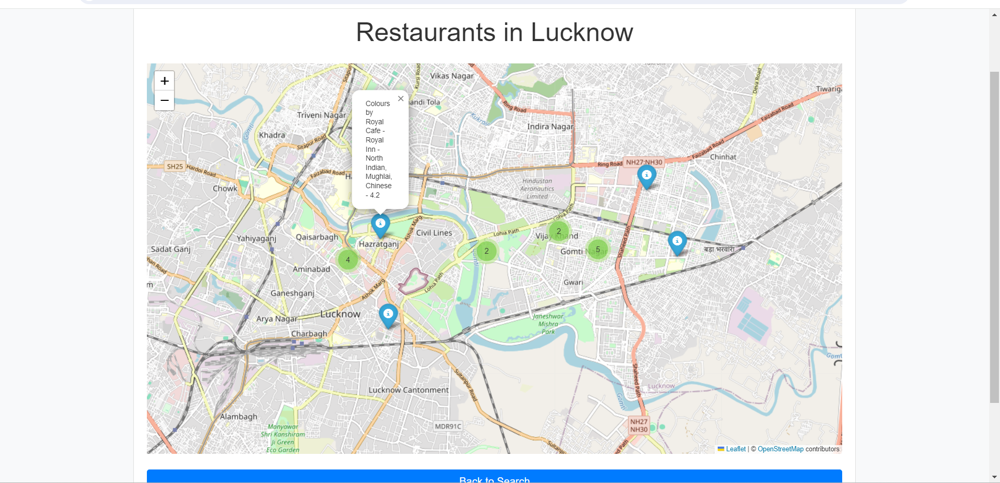
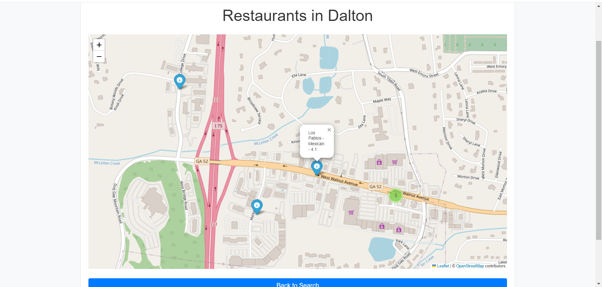

# Restaurant Location-Based Analysis by Machine Learning

This project aims to perform restaurant location-based analysis using machine learning techniques. It involves predicting restaurant ratings based on user inputs and displaying restaurant locations on a map.

## Table of Contents

- [Overview](#overview)
- [Features](#features)
- [Installation](#installation)
- [Usage](#usage)
- [File Structure](#file-structure)
- [Technologies Used](#technologies-used)
- [Contributing](#contributing)
- [License](#license)

## File Structure:

```

restaurant-location-analysis/
│
├── model/
│   ├── ML_model.ipynb
│   └── ...
│
├── static/
│   ├── css/
│   │   ├── styles.css
│   │   ├── other css if yu have add 
│   │   └── ...
│   ├── js/
│   │   ├── script.js
│   │   └── ...
│   ├── templates/
│       ├── ..all templates here
│       └── ...
│    
│    
│    
│
├── .env.example
|-- app.py
├── .gitignore
├── package.json
├── README.md
└── ...

```


## Project Frontend:

## Video Link:

https://github.com/Blacksujit/Location_Based_Analysis/assets/148805811/a8b3d6d3-96a1-41fe-b346-acd301857e99


## Home Page (User interactiveness):


## Some Restaurents recoomeded by ML model on maps:

## 1st map:



## 2nd map:




## Overview

The project integrates machine learning models to predict restaurant ratings and displays their locations on a map. Users can input various criteria, and the ML model provides predictions based on historical data.

## Features

- **ML Model Integration:** Uses machine learning to predict restaurant ratings.

- **Interactive Map:** Displays restaurant locations on a map for easy visualization.

- **User Input:** Accepts user inputs to customize the analysis and predictions.

## Installation

Follow these steps to set up the project locally:

1. **Clone the repository:**
   ```bash
   git clone  https://github.com/Blacksujit/Location_Based_Analysis.git
   cd restaurant-location-analysis


2. **Install dependencies:**

    ```bash
    pip install -r requirements.txt
    ```

3. **Run the application:**

   ```bash
   python app.py
   ```

## Technologies Used:

1.) Frontend: js , HTML, CSS

2.) Backend: Python (for ML model):

restaurents prediction using various ML algorithms

## Usage:

1.) It can be used to achive the solutions in small segements of the ecoomerece sites where they find things difficult to track 

2.) It can also be used in hilly areas if implemented propely with the proper software base to track near by locations 

 
## Contributing:

Contributions are welcome! If you have any ideas, improvements, or issues, feel free to open a pull request or raise an issue.

## License:

This project is licensed under the MIT License - see the  

